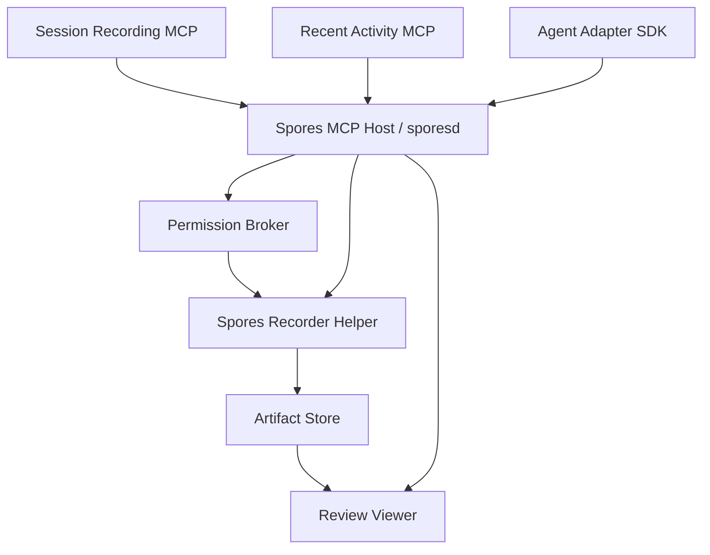

# Service Plans

Each service has a separate plan file. Keep implementation aligned to these
boundaries unless the product shape changes.

## Services

1. [Spores MCP Host and `sporesd`](01-sporesd-control-plane.md)
2. [Spores Recorder Helper](02-recorder-helper.md)
3. [Permission Broker and Installer](03-permission-broker-installer.md)
4. [Session Recording MCP](04-session-recording-mcp.md)
5. [Recent Activity MCP](05-recent-activity-mcp.md)
6. [Agent Adapter SDK](06-agent-adapter-sdk.md)
7. [Review Viewer](07-review-viewer.md)
8. [Artifact Store and Indexer](08-artifact-store-indexer.md)

## Dependency Graph

## Implementation Rule

The native helper owns capture and OS permissions. The MCP host owns product
state, local APIs, and tool routing. Dedicated MCP surfaces should be thin
clients over the same internal protocol.
